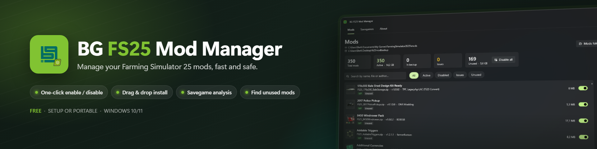
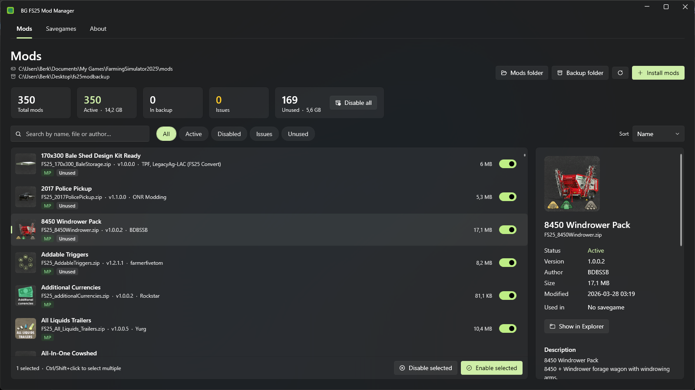
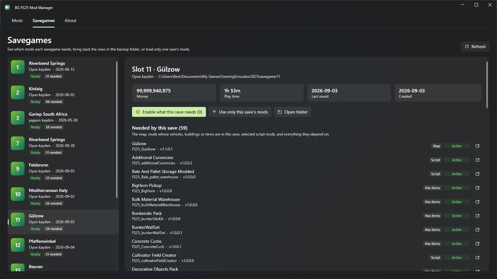
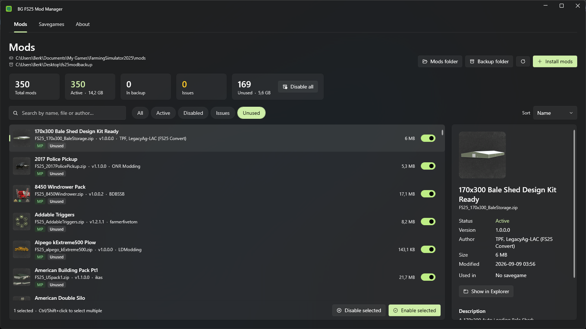
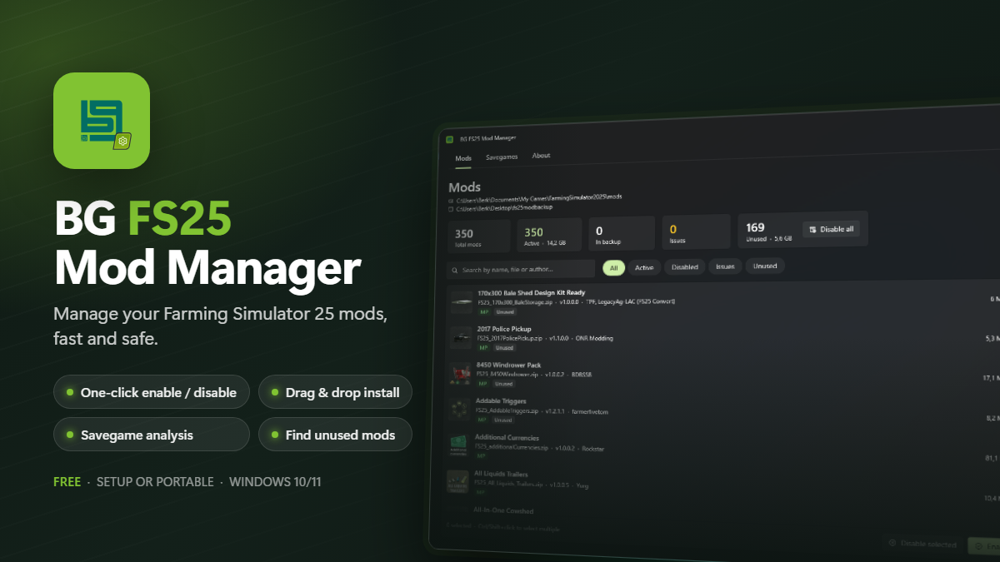
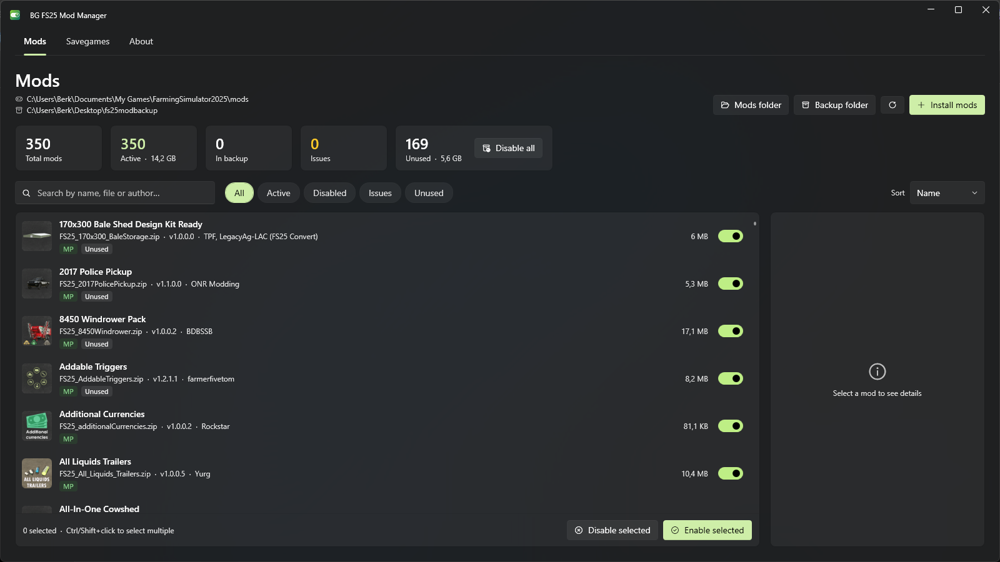
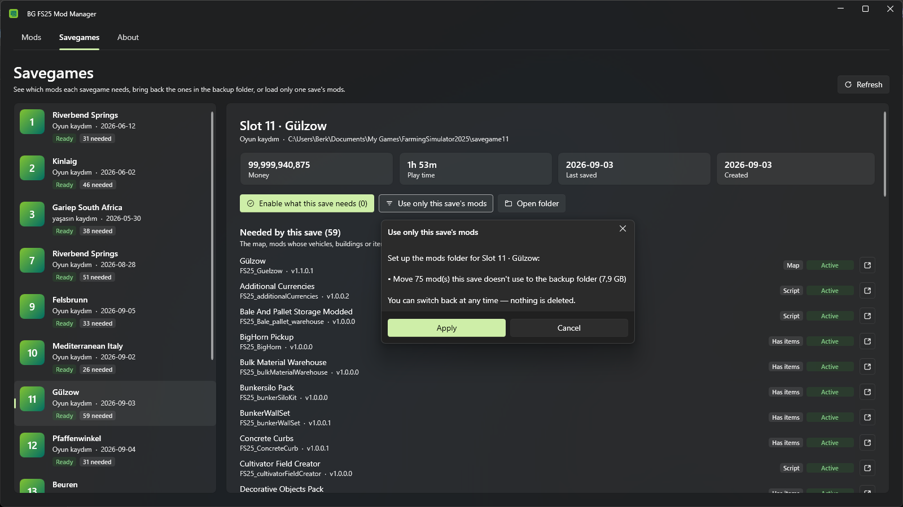
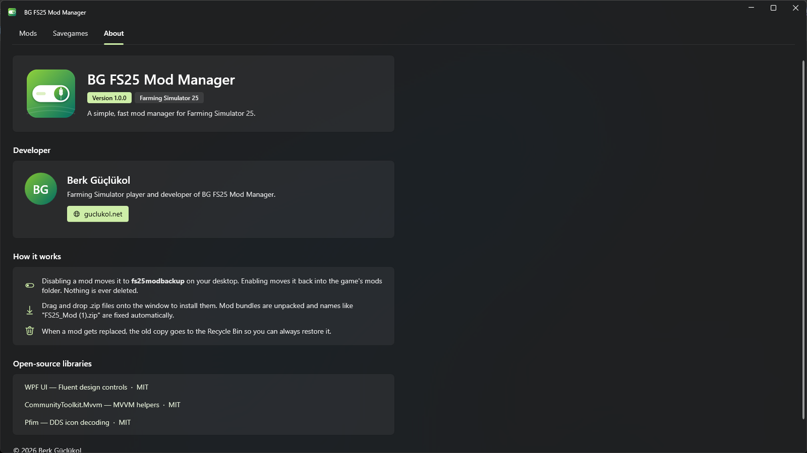

<p align="center">
  
</p>

<p align="center">
  <a href="https://github.com/berkguclukol/bgfs25modmanager/releases/latest"></a>
  <a href="https://github.com/berkguclukol/bgfs25modmanager/releases"></a>
  
  
</p>

<p align="center">
  <b>A fast, modern mod manager for Farming Simulator 25.</b><br>
  Enable and disable mods with one click, install mods by drag &amp; drop,<br>
  and see exactly which mods each savegame needs.
</p>

<p align="center">
  <a href="https://github.com/berkguclukol/bgfs25modmanager/releases/latest/download/BGFS25ModManager-win-Setup.exe"><b>⬇ Download Setup</b></a>
  &nbsp;·&nbsp;
  <a href="https://github.com/berkguclukol/bgfs25modmanager/releases/latest/download/BGFS25ModManager-win-Portable.zip"><b>⬇ Download Portable</b></a>
</p>

---

## ✨ Features

### 🔀 One-click enable / disable
Disabled mods are moved to a `fs25modbackup` folder on your desktop and enabled mods are moved back into the game's mods folder. **Nothing is ever deleted** — when a mod gets replaced, the old copy goes to the Recycle Bin.



### 📦 Drag & drop install
Drop `.zip` files onto the window (or use **Install mods**). The installer takes care of the annoying stuff:
- mod bundles (a zip full of mods) are unpacked,
- mods wrapped in an extra folder are repacked correctly,
- names the game refuses to load, like `FS25_Mod (1).zip`, are fixed automatically.

### 🗂️ Savegame analysis
See which mods each savegame really needs — the map, mods whose vehicles, buildings or items are in the save, script mods and all their dependencies — and whether they are **active**, **in the backup folder** or **missing**.

- **Enable what this save needs** brings the right mods back from the backup folder.
- **Use only this save's mods** moves everything else to the backup folder, so the game loads faster. Switch back any time.



### 🧹 Find unused mods
Mods that no savegame uses are flagged as **Unused**, together with how much space they take. Move them all to the backup folder with a single click.



### ✅ And more
- Automatic, silent **updates** from inside the app (v1.1.0+)
- Checks for **duplicates**, **missing dependencies**, **unreadable `modDesc.xml`** and **invalid file names**
- Mod icons, titles, versions, authors and descriptions read straight from the mods (DDS icons, localized titles)
- Search, filters and sorting · auto-refresh when your mod folders change
- Supports a custom mods folder (`modsDirectoryOverride` in `gameSettings.xml`)

---

## ⬇️ Download



| | Download | |
| --- | --- | --- |
| **Setup** *(recommended)* | [BGFS25ModManager-win-Setup.exe](https://github.com/berkguclukol/bgfs25modmanager/releases/latest/download/BGFS25ModManager-win-Setup.exe) | Installs in seconds without a wizard, adds Start menu and desktop shortcuts. |
| **Portable** | [BGFS25ModManager-win-Portable.zip](https://github.com/berkguclukol/bgfs25modmanager/releases/latest/download/BGFS25ModManager-win-Portable.zip) | Extract anywhere and run `BG FS25 Mod Manager.exe`. |

No .NET installation needed · Windows 10/11 (64-bit) · both versions update themselves.

> [!NOTE]
> **Windows SmartScreen:** the app isn't code-signed yet, so Windows may show *"Windows protected your PC"* the first time. Click **More info → Run anyway**.

> [!IMPORTANT]
> This is a Windows tool, **not an in-game mod** — don't put it in your mods folder. Close the game before enabling or disabling mods (or restart it afterwards).

---

## 🖼️ Screenshots

| Mods | Mod details |
| :---: | :---: |
|  |  |
| **Unused mods** | **Savegames** |
|  |  |
| **Use only one save's mods** | **About** |
|  |  |

---

## 🛠️ Building from source

Requires the [.NET 10 SDK](https://dotnet.microsoft.com/download).

```bash
dotnet build
dotnet run --project src/FS25ModManager
```

### Creating a release
Releases are packaged with [Velopack](https://velopack.io), which produces the setup, the portable zip and the update packages.

```bash
dotnet tool install -g vpk
dotnet publish src/FS25ModManager/FS25ModManager.csproj -c Release -r win-x64 --self-contained -o publish
vpk download github --repoUrl https://github.com/berkguclukol/bgfs25modmanager -o releases
vpk pack --packId BGFS25ModManager --packVersion 1.x.x --packDir publish --mainExe BGFS25ModManager.exe --packTitle "BG FS25 Mod Manager" --icon src/FS25ModManager/Assets/app.ico -o releases
vpk upload github --repoUrl https://github.com/berkguclukol/bgfs25modmanager --token <token> -o releases --publish --tag v1.x.x
```

Bump `<Version>` in `src/FS25ModManager/FS25ModManager.csproj` first — the app shows that version and uses it for update checks.

### Project layout

| Path | Purpose |
| --- | --- |
| `src/FS25ModManager/Services/` | Scanning mods and savegames, moving and installing files, updates |
| `src/FS25ModManager/ViewModels/` | Application logic (MVVM) |
| `src/FS25ModManager/MainWindow.xaml` | UI |
| `src/FS25ModManager/AppInfo.cs` | Name, developer details and links shown on the About page |
| `src/FS25ModManager/Assets/` | Logo (SVG sources, PNG, ICO) |

---

## 🙏 Credits

Made by **Berk Güçlükol** · [guclukol.net](https://guclukol.net)

Built with [WPF UI](https://github.com/lepoco/wpfui), [CommunityToolkit.Mvvm](https://github.com/CommunityToolkit/dotnet), [Pfim](https://github.com/nickbabcock/Pfim) and [Velopack](https://github.com/velopack/velopack) — see [THIRD-PARTY-NOTICES.txt](THIRD-PARTY-NOTICES.txt).

<sub>Not affiliated with or endorsed by GIANTS Software. Farming Simulator is a trademark of GIANTS Software GmbH.</sub>
